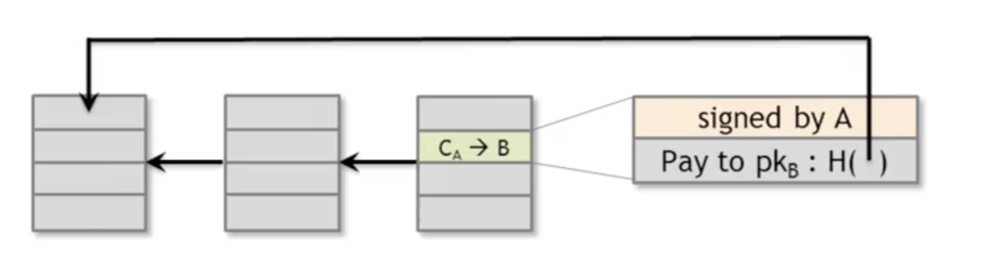
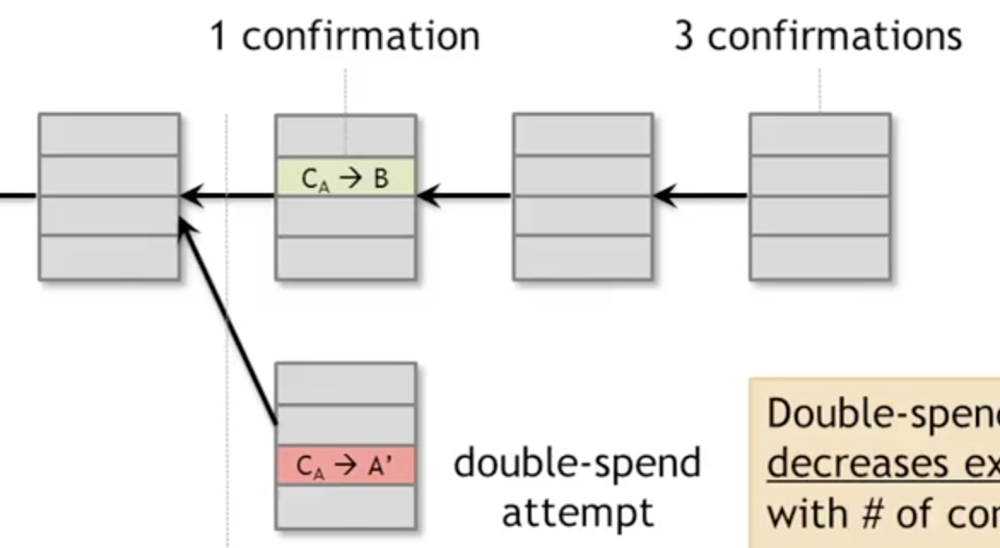
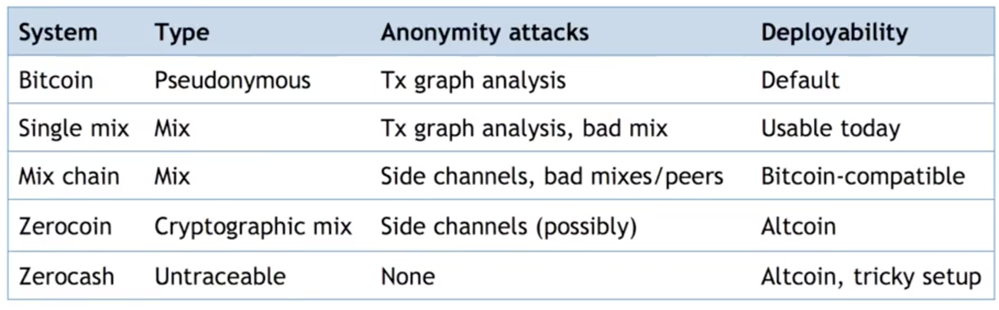

Notes from [Coursera's Introduction to Crypto and Cryptocurrencies - Princeton University - Course](https://www.coursera.org/lecture/cryptocurrency/welcome-RgEDS).

## Hashes

Hash must be:

1. Collision resistent
    1. Application - Hash as Message Digest

2. Hiding - Given H(r \| x), r is chosen with high entropy. Hard to find H(y) = H(r \| x)
    1. Ie Given Hash hard to find input

3. Puzzle friendly - H(k \| x) = y, hard to find x
    1. I.e. Hard to get Hash output to be a particular value

## Commitment API

`(com, sk) := commit(msg)`

`match := verify(com, sk, msg)``

Think of `com` as envelope and `sk` to unlock envelope.

To seal: commit and then publish com

To open: publish sk and msg. Anyone can verify.

Properties:

1. Hiding: Given com, infeasible to find msg.
2. Binding: Infeasible to find msg != msg’ such that verify(commit(msg), msg’) == true

## Hash pointer

Where something is and what its value was

* Can use in any pointer-based Data Structure
* tamper evident
    * linked list = tamper evident log

* Block chain
* Merkle tree - Binary tree w/ Hash Pointers
    * Can verify membership in O(log n)
    * If sorted, can verify non-membership

## Digital Signature

`sig := sign(sk, message)`

`isValid := verify(pk, message, sig)`

## Decentralized ID management

* random public key - addresses in Bitcoin

Nodes don’t have Identities - no central authority to grant IDs, makes things harder

_Sybil Attack_ - copy nodes to look like many

Double-spending attack

- include Transaction history to avoid

Node Latency - No notion of global time.

Explore: Byzantine generals problem and Fischer-Lynch-Peterson Impossibility Result

## Consistency Protocols

Paxos

* Never produces inconsistent result
* Can rarely get stuck

Bitcoin violates theory to make work. Things done differently:

1. Introduces incentives - possibly only b/c it’s a currency.
2. Embraces randomness - consensus happens over long time scales

## Consensus Algorithm (Simplified)

1. New transactions are broadcast to all nodes.
2. Each node collects new transactions into a block.
3. In each round, a random node gets to broadcast its block.
4. Other nodes accept the block only if all transactions in it are valid (unspent and valid signature)
5. Nodes express their acceptance of block by including its hash in the next block they create.

Alice pays Bob. Block of transactions has pointer to previous block. Transaction has hash pointer to originating transaction.

Confirmation when block pointer added:

## Recap

1. Protection against invalid transactions is cryptographic, but enforced by consensus.
2. Protection against double spending is purely consensus.
3. Probabilistic guarantee of transaction is in consensus branch. Common heuristic is 6 confirmations

## Incentives

1. Block reward - special coin-creation transaction in the block
2. Transaction Fee - creator of transaction can choose to make output value less than input value. Remainder goes to block creator (like tip).

## Proof of Work

- approximate selecting a random node by selecting nodes in proportion to a resource that no can monopolized (computing power)

* Nodes compete for right to create block
* Make it moderately hard to create new identities (protect against Sybil attack)
* Hash Puzzles - block must contain nonce (solution to puzzle)
    * Currently about 10^20 hashes/block
        * Recalculate target every 2 weeks w/ goal of average 10 minutes per block (Block Latency)

    * Bernoulli trial is a random experiment with exactly two possible outcomes, "success" and "failure", in which the probability of success is the same every time the experiment is conducted.

51% attacker could suppress transactions from blockchain, put not P2P network **

** would estroy confidence in Bitcoin**

## Bitcoin Transaction

* Change address - send left over bitcoins back to self

## Bitcoin Scripts

* Input (scriptSig) and output (scriptPubKey) addresses are really scripts
    * <sig> <pubKey> OP_DUP OP_HASH160 <pubKeyHash> OP_EQUALITY OP_CHECKSIG

* to verify: concatenate script must execute w/o errors
* Inspired by Forth — stacked based language (no loops)
    * Not Turing-complete — no halting problem

* Proof-of-burn - put something arbitrary in blockchain OP_RETURN
* Hash of Redemption Script
    * Pay to Script Hash

Escrow Transactions  - 2 of 3 multisig

Green Addresses - Bank agrees to pay Bob

## Micro Payments w/ Micro-sig

* Send transaction every minute signed by buyer
* At the end seller only signs last transaction
* lock_time used— don’t publish transaction until some time in future

## Bitcoin Network

* P2P Network
* Adhoc protocol - runs on TCP port 8333
* Random topology
* All nodes equal
* New nodes can join at any time - non-responding nodes are dropped after ~3hrs

## Transactions across network

* Flooding algorithm
    * Gossip Protocol - if you have news, try to tell as many people as you can

* Nodes propagate only if valid transaction
    * script matches whitelist
    * haven’t seen before
    * coins haven’t been spent already

* Blocks similar
    * Meets hash target
    * Has all valid transactions
    * Build on current longest chain — Avoids forks

* Chooses decentralized/openness to efficiently (takes on average 30s for block to propagate)

Fully validated node vs Thin/SVP client (don’t store entire blockchain, request transactions as needed, trust FVN)

### Limitations

* 10 minute time per block
* 1 MB block size
* 20K signature operations per block
* 100M satoshi per bitcoin (divisibility)
* Total # of bitcoins in existence fixed
* Mining reward Fixed
* 7 transactions/sec
* Crypographic algos fixed (ECDSA/P256)

## Soft Fork

Add new features that only limit set of valid transactions

* Need majority of nodes to enforce new rules
    * e.g. Pay to Script Hash

## Storing Secret Key

1. Availabiltiy
2. Security
3. Convenience

## Wallet Software

* Many keys—    seperate key for each coin

## Hot and Cold Storage

* Cold storage not online
* separate secret keys/addresses

Hierarchical Wallet - hierarchical key generation

## Splitting and Sharing Keys

* Secret sharing -
    * split secret into N pieces
        * need at least K pieces to reconstruct secret, don’t know anything if have < K pieces
            * K = 2 line (S + RX) mod P
            * K = 3 quadratic

    * Problem have to recombine to get secret key
    * Multi-sig safer atlernative

## Proof of Reserve

1. Prove how much reserve you’re holding (X)
    1. publish valid pay-to-self amount and sign challenge string w/ same private key

2. Prove how many demand deposits you hold (Y)
    1. Merkle tree w/ subtree total

3. Reserve fraction = X/Y

transaction fee = value of inputs - value of outputs, fee goes to miner

Goodput = throughput x success rate

FPGA - Field Programmable Gate Arrays

_Landauer’s Principle_ - Any non-reversible computation must consume a minimum amount of energy

_Mining shares_ - can prove how much work done when participating in mining pool

## Checkpointing

- guard against forking attack

* In bitcoin code, prevents forking from a certain point

Block-withholding attack - find 2 blocks in a row. Will orphan next proposed valid block by another node.

## Anonymity

Anonymity = pseudonymity + unlinkability

Blind Signature - first anonymous e-cash

* Always receive at new address
    * Problems: _Shared spending_ is evidence of joint control
        * Addresses can be linked transitively

    * Idioms of use - change address

Mixing - use intermediary (proxy) to mix coin input/outputs

*     Promise: won’t keep records, no need for identity

*     online wallets can somewhat function like one

Principles:

1. Use a series of mixes (currently, not the case)
2. Uniform transaction value, “chunk,” size 
3. Must be automated (built into online wallet software) to avoid other attacks like timing
4. Fees must be all or nothing

## Decentralized Mixing, e.g. Coinjoin

1. Find peers who want to mix
2. Exchange input/output addresses
3. Construct transaction
4. Send it around to collect signatures
5. Broadcast transaction

Problems:

1. How to find peers
2. Peers know you input-output mapping
    1. Solution: decryption mixmaps

3. DoS
    1. Solution: Proof of work/burn (fidelity bonds)

Merge avoidance - multiple input/output addresses

## Zerocoin

*     Mixing backed in
*     Mint and put _com (keyed hash of serial number) _on blockchain
    * Burn a “Basecoin”
* Reveal SN to spend
* Can pick arbitrary zero coin in blockchain (leads to anyominity)

