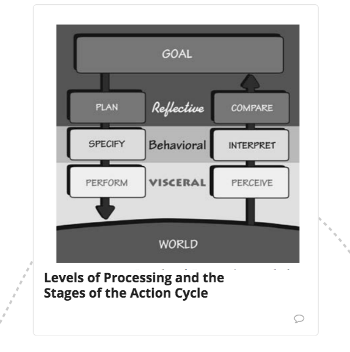
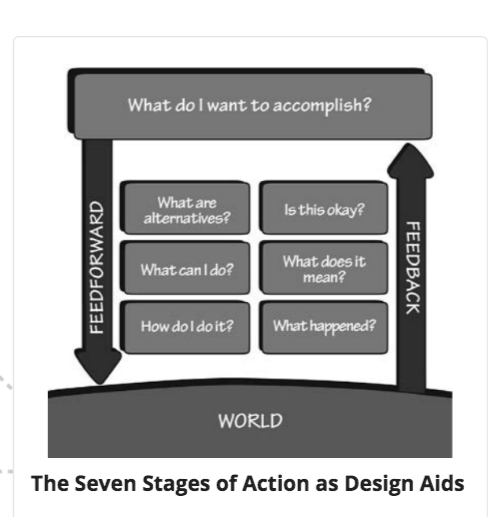
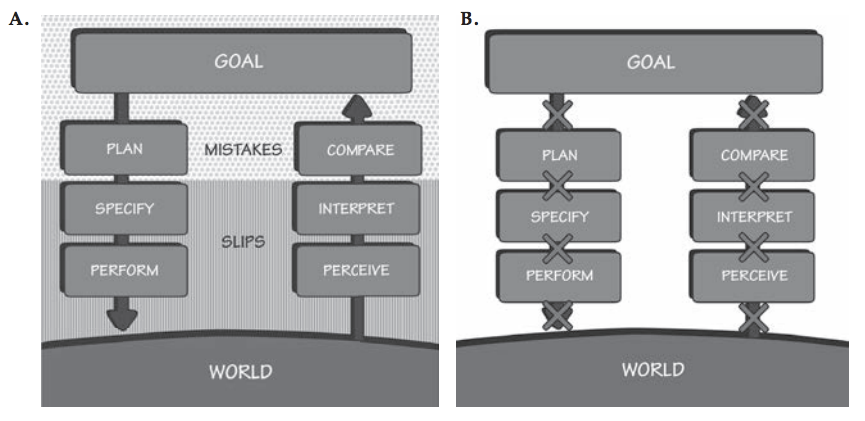
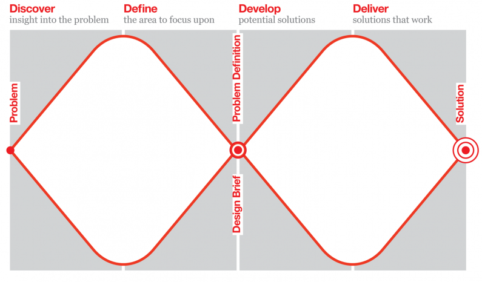

Notes for the book, [The Design of Everyday Things by Don Norman](https://amazon.com/Design-Everyday-Things-Revised-Expanded/dp/0465050654). These are rough notes, and may contain spelling and grammatical errors.

## Discoverability

Affordance (what actions are possible) vs Signifiers (how people discover these possibilities).

Discoverability: what actions are possible.

Understanding: what can the product be used for, how is it supposed to be used.

Discoverability results from:

1. Affordances - relationship between physical object and person. e.g. Chair affords support and therefor sitting. Light chair affords movability through lifting.
    1. Some are perceivable other are not. Signifiers help make more perceivable.
    2. Anti-affordance - prevention of interaction, e.g. glass doesn’t allow physical passage.

2. Signifiers
    1. Must be perceived to work.
    2. Signs, e.g. Push, Pull on door.
    3. Perceived affordances, e.g. Handle of door.
        1. May not be real, e.g. a door with a handle that can’t be pulled

3. Constraints
4. Mappings, e.g. which switches control which lights
    1. [Gestalt psychology](https://en.wikipedia.org/wiki/Gestalt_psychology)
        1. Controls should be grouped according to function.
        2. Should be close to the item being controlled.

5. Feedback - repeating pushing cross walk button
    1. Must be immediate.
    2. Must be prioritized eg life threatening emergency vs Facebook tag otherwise leads to ignoring all.

Mental models - conceptional models in people’s mind that represent their understanding of how something works.

* Different professions, people in general, will have different mental models, based on level of abstraction
* Can have different mental models for same object

System Image - Combined information available to us about a product, e.g. website, manual, what device looks like, similar products.

Only need internalize enough detail to distinguish items, e.g. Shape size of penny, not all the details on the face.

## 2 steps of doing and interrupting 

Gulf of Execution -try to figure out how to use. Fixed by Signifiers, Mappers, etc.

Gulf of Evaluation - try to figure out state it is in. Did actions get to goal? Fixed by using Feedback.

## 7 Stages of Actions

1. Form the Goal
2. Execution
    1. Plan the action
    2. Specify the sequence of sub-actions
    3. Perform the sequence

3. Evaluation
    1. Perceive the state
    2. Interpret the perception
    3. Compare the outcome to the goal

Root cause analysis - asking why until the fundamental cause of activity is reached - where radical ideas happen.

Focus on Gulfs to enhance existing products.

“People don’t want to buy a quarter inch drill. They want a quarter inch hole.” Why do they want hole? To install bookshelf. (Idea of sub-goals). Maybe hole is not needed to bookshelf can be installed w/o one (root cause analysis).

Emotion as an information processing system used in tandem with cognition.

Every action is associated with an expectation.

Provide feedback w/i 0.1 seconds of an action.

Wise to under predict how long an operation will take. eg Say expected to complete in 15 s when actually expect it to take 10.

* designer must ensure product provides the information to answer each question

Knowledge available in world vs head.

Declarative eg Factual vs Procedural knowledge.

Can only hold ~5 items in Short Term Memory at one time.

Four Types of Constraints

1. Physical
    1. More useful if they are easy to see and interpret b/c doesn’t require one to try and fail.
    2. Legacy problem w/ batteries - can be inserted wrong way, but too many products already use them to fix.

2. Cultural - red light culturally defined as stop
3. Semantic - meaning. eg Windshield makes sense to go in front of rider
4. Logical - eg Part left over after reassembly

Forcing Function -failure at one stage prevents proceeding to next, e.g. car key/ignition.

1. Interlocks - operations take place in proper sequence e.g. break pedal depressed before put car in Drive
2. Lock Ins - keeps an operation active, preventing premature stopping. eg. Prompt to save a file before exiting
3. Lock Outs - prevents an event from occurring eg highway exit gates, child cabinet locks

2 types of human errors:

1. Slips - intending to do one action, but doing another instead
    1. Action-based - wrong action is performed
    2. Memory-lapse - forgetting to do an action

2. Mistakes - wrong goal/plan is established
    1. Rule-based - diagnosed the situation, but then decided on wrong action - wrong rule being followed
    2. Knowledge-based - problem misdiagnosed b/c of erroneous or incomplete knowledge
    3. Memory-lapse - forgetting stages of goals, plans or evaluation

Paradoxically, slips tend to happen to the more skilled due to lack of attention to task.

Capture Slips - Do ingrained, more frequently or recently performed activity, instead of desired one.

Description-similarity slips - act upon an item similar to the target - eg throw dirty shirt into toilet.

Mode-slip errors - device has different states in which same controls have different meanings eg Remotes that control TV, DVD, etc.

3 modes of behavior:

1. Rule-based - wrong rule select = mistake * 
2. Skilled-based - most common mistakes are slips
3. Knowledge-based *
* - most serious mistakes occur when situation is misdiagnosed

Checklists - sequential structure; need a way to track skipped.

Common problem: _**interruptions**_ causing users to forget state of system.

## Swiss Cheese Modal of How Accidents Happen

** Accidents have multiple causes, not single like media portrays.

** Unless all holes lineup, there will be no accident.

To make a system safer:

1. Add extra precautions/safe-gaurds against errors (more slices).
2. Less opportunities for slips, mistakes or equipment failures (less holes or make holes smaller).
3. Different mechanisms in different subparts of the system (holes don’t line up).
4. Alert operator when several holes line up (monitor the cheese).

Two components of design:

1. Find the right problem i.e. Question if the given problem is actually causing the issue.
2. Meet human needs and capabilities.

## Double Diamond Model of Design

1. Discover - expand scope of problem
2. Define
3. Develop - expand space of possible solutions
4. Deliver

* Testing and prototyping is done in both problem specification (helps to ensure well understood) and solution (helps to ensure meets needs and abilities of users) phases

## Human Centered Design

1. Observation
2. Idea Generation
3. Prototyping
4. Testing
5. Iterate

Stupid questions are good. The obvious is not always obvious, just has been accepted for so long that it is no longer questioned.

Focus on activity when designing a product.

Balancing priorities of different groups. Designers want to ensure human needs are met. Marketers want to make sure product sells and is used. All groups should be in the design process from the start so all group priorities are meet to best of ability.
